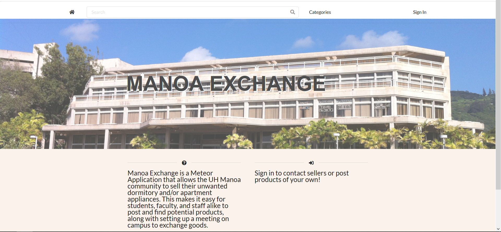
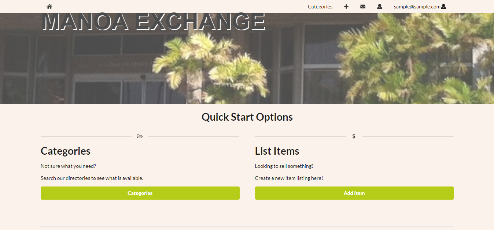
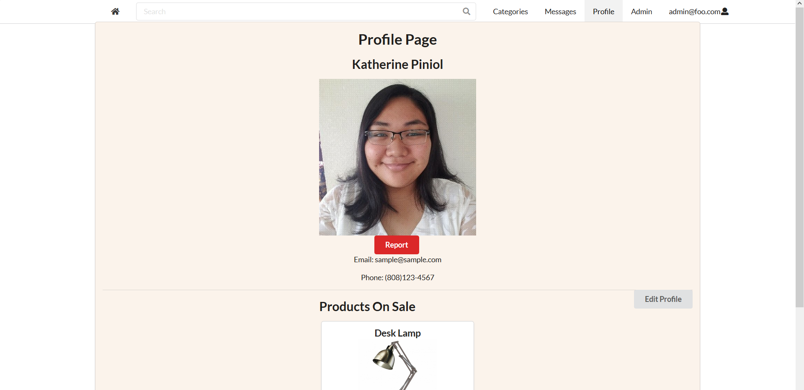
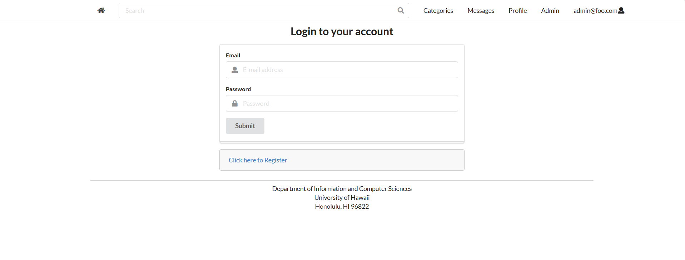
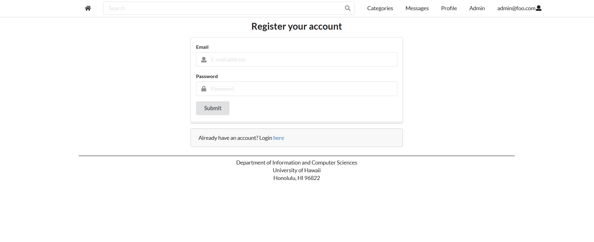

### Links 

[Project Board](https://github.com/manoaexchange/manoaexchange/projects) | [App Code](https://github.com/manoaexchange/manoaexchange) | [Galaxy](https://galaxy.meteor.com/app/manoaexchange.meteorapp.com) 

---

## Table of Contents
* [Overview](#overview)
* [Goals](#goals)
* [Installation](#installation)
* [Mockup Pages](#mockup-pages)
* [Progress](#progress)
  * [Milestone 1](#milestone-1)
   * [Milestone 2](#milestone-2)
* [Contributors](#contributors)

---

## Overview

Manoa Exchange is a Meteor Application that allows the UH Manoa community to sell their unwanted dormitory and/or apartment appliances. This makes it easy for students, faculty, and staff alike to post and find potential products, along with setting up a meeting on campus to exchange goods. 

---

## Goals 

* Connect the UH Manoa community 
* Buy/Sell goods
* Provide an easy to use interface to facilitate transfer of goods between people

---

## Installation 

1. Install [meteor.](https://www.meteor.com/install)
2. Download [Manoa Exchange.](https://github.com/manoaexchange/manoaexchange)
3. CD into app/ directory and install libraries.
`meteor npm install`
4. Run application.
`meteor npm run start`
5. Open Application on [http://localhost:3000/.](http://localhost:3000/)

---

## Startup

Manoa Exchange is a UH community tool.  Registration will be required for access to all features of the application.  To register, click sign in at the top right of the page, and in the dropdown menu, click sign up.  You will be taken to the sign up page to quickly create an account, after creation you will have full access to the features the application.  You will be able to search for a multitude of items being offered by members of the UH community, or list items of your own.

---

## Mockup Pages

### Landing Page

### Home Page

### User Page

### Sign in page

### Sign up page

---

## Development Progress

This section shows our progress in creating the application. 

### Milestone 1

**Status: Complete**

**Date: 3/31/19-4/11/19**

Start creating mockup pages for a select few pages. We first started coding in a React application. Once we had our mockup pages created, we transferred it over to the Meteor application. Along with the mockup pages, links toward over half the pages work, but are not implemented yet. 

Pages Worked On:
* Landing page
* Sign in/Sign up pages
* User Home page
* Profile page
* Message Page
* Report page

See [Milestone 1 Project Board](https://github.com/manoaexchange/manoaexchange/projects/1) for more details.

### Milestone 2

**Status: Incomplete**

**Date: 4/12/19-**

Finish Mockup for remaining pages and implement functions of Milestone 1 pages along with a few extra functions. 

See [Milestone 2 Project Board](https://github.com/manoaexchange/manoaexchange/projects/2) for more details.

---

## Contributors

This was a joint project created by [Shawn Anthony,](https://shawn-anthony.github.io/ "Shawn Anthony") [Christopher Na,](https://chrisn3.github.io/ "Christopher Na") and [Katherine Piniol.](https://piniolk.github.io/ "Katherine Piniol")
