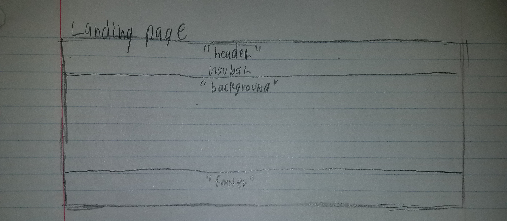
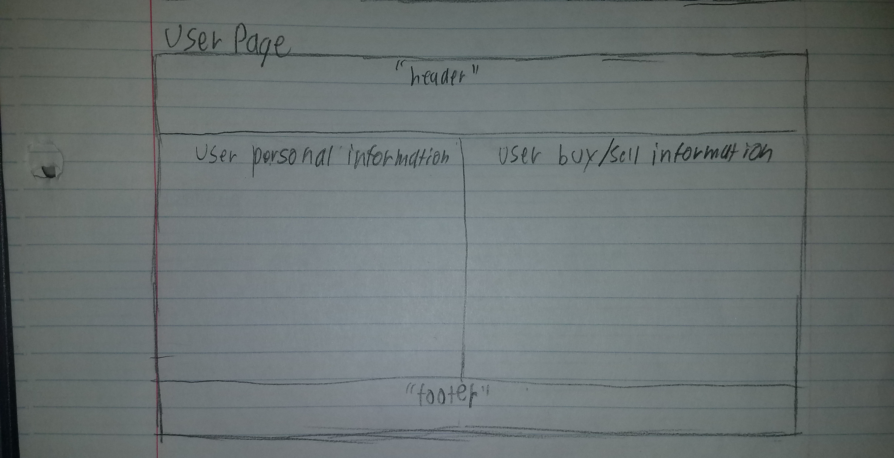
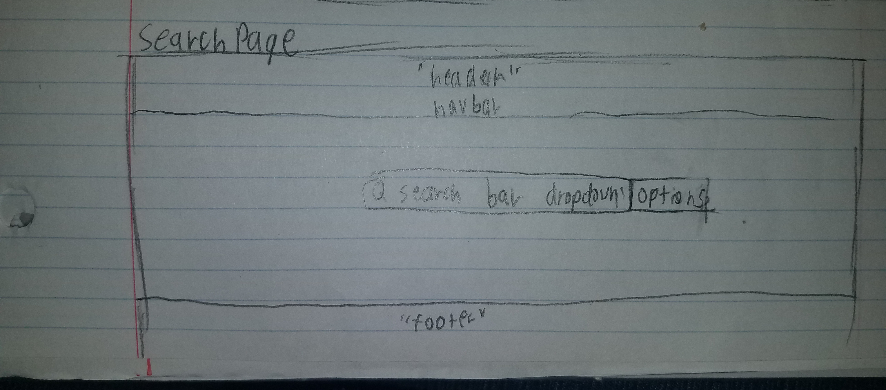
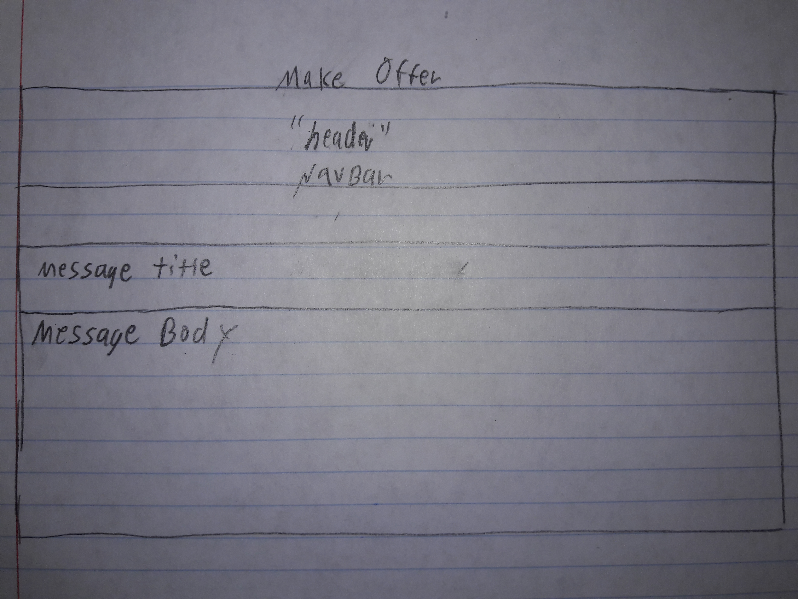

# Manoa Exchange

## Table of Contents
* [Overview](#overview)
* [Goals](#goals)
* [Installation](#installation)
* [Mockup Pages](#mockup-pages)
* [Progress](#progress)
  * [Milestone 1](#milestone-1)
* [Contributers](#contributers)

## Overview

Manoa Exchange is a Meteor Application that allows the UH Manoa community to sell their unwanted dormitory and/or apartment appliances. This makes it easy for students, faculty, and staff alike to post and find potential products, along with setting up a meeting on campus to exchange goods. 

## Goals 

* Connect the UH Manoa community 
* Buy/Sell goods

## Installation 

1. Install [meteor.](https://www.meteor.com/install)
2. Download [Manoa Exchange.](https://github.com/manoaexchange/manoaexchange)
3. CD into app/ directory and install libraries.
`meteor npm install`
4. Run application.
`meteor npm run start`
5. Open Application on [http://localhost:3000/.](http://localhost:3000/)

## Mockup Pages

### Landing Page

### User Page

### Search Page

### Offer Page

## Progress

### Milestone 1

Start creating mockup pages for select few pages. These include the landing page, home pages, profile page, and notification pages.
See [Project Board](https://github.com/manoaexchange/manoaexchange/projects/1) for more details.

## Contributers

This was a joint project created by [Shawn Anthony,](https://shawn-anthony.github.io/ "Shawn Anothony") [Christopher Na,](https://chrisn3.github.io/ "Christopher Na") and [Katherine Piniol.](https://piniolk.github.io/ "Katherine Piniol")
