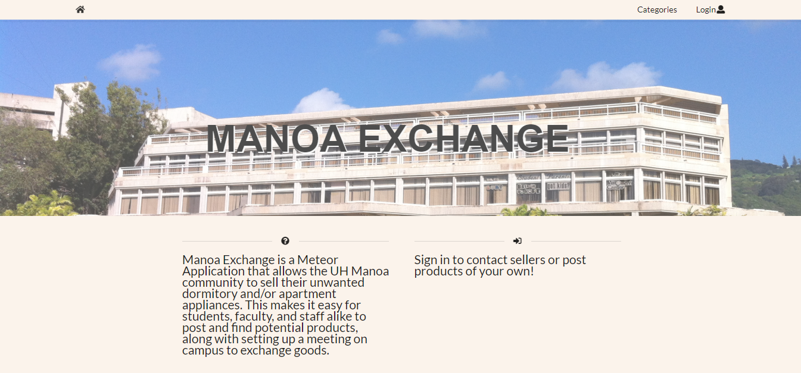

## Table of Contents
* [Overview](#overview)
* [Goals](#goals)
* [Installation](#installation)
* [Mockup Pages](#mockup-pages)
* [Progress](#progress)
  * [Milestone 1](#milestone-1)
   * [Milestone 2](#milestone-2)
* [Contributers](#contributers)

---

## Overview

Manoa Exchange is a Meteor Application that allows the UH Manoa community to sell their unwanted dormitory and/or apartment appliances. This makes it easy for students, faculty, and staff alike to post and find potential products, along with setting up a meeting on campus to exchange goods. 

---

## Goals 

* Connect the UH Manoa community 
* Buy/Sell goods
* Provide an easy to use interface to facilitate transfer of goods between people

---

## Installation 

1. Install [meteor.](https://www.meteor.com/install)
2. Download [Manoa Exchange.](https://github.com/manoaexchange/manoaexchange)
3. CD into app/ directory and install libraries.
`meteor npm install`
4. Run application.
`meteor npm run start`
5. Open Application on [http://localhost:3000/.](http://localhost:3000/)

---

## Startup

Manoa Exchange is a UH community tool.  Registration will be required for access to all features of the application.  To register, click sign in at the top right of the page, and in the dropdown menu, click sign up.  You will be taken to the sign up page to quickly create an account, after creation you will have full access to the features the application.  You will be able to search for a multitude of items being offered by members of the UH community, or list items of your own.

---

## Interface Walkthrough 

### Landing Page
The first page you will see is the introduction page, letting you know the capabilities of the application.

### Register an account 
In order to access the features of ManoaExchange, you need to register

### Sign in page
If you have an account, click the login icon on the top right of the website.

### Home Page
Logging in will redirect you to the home page which will allow you further access to features of the application.

### User Page
One feature is creating a profile page to see a summary of currently listed items for sale. You may also view other users profile pages.

### Message a seller
If you see an item you would like to purchase, message the buyer with an offer or to simply meet up.

### Report a user
Unfortunately you may run into inappropriate behavior from other users on this site. CLick on the report button to notify an admin of the issue.

---

## Progress

### Milestone 1

Start creating mockup pages for a select few pages. These include the landing page, home pages, profile page, and notification pages.  Began work on important site-wide components; these included a Nav bar to be displayed on every page, and the react-router to handle the linking of pages.
See [Project Board](https://github.com/manoaexchange/manoaexchange/projects/1) for more details.

### Milestone 2

---

## Contributers

This was a joint project created by [Shawn Anthony,](https://shawn-anthony.github.io/ "Shawn Anothony") [Christopher Na,](https://chrisn3.github.io/ "Christopher Na") and [Katherine Piniol.](https://piniolk.github.io/ "Katherine Piniol")
